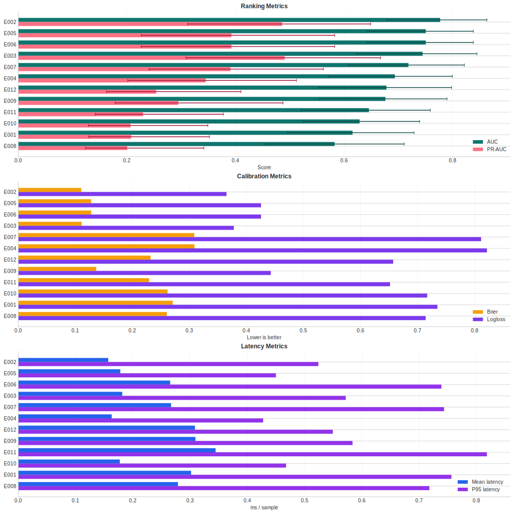
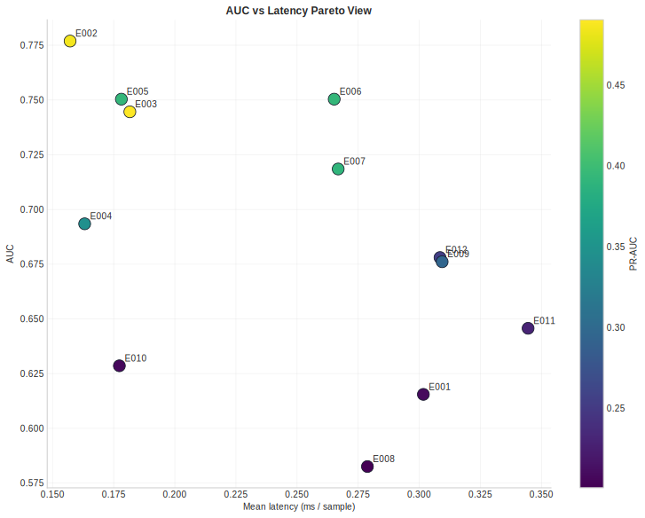
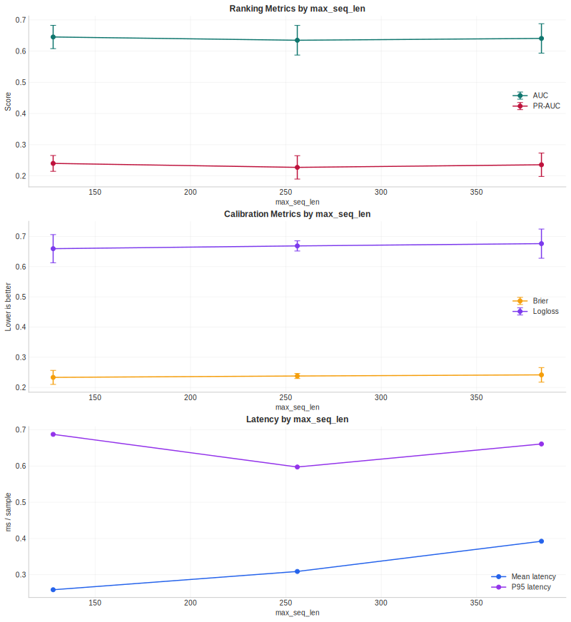
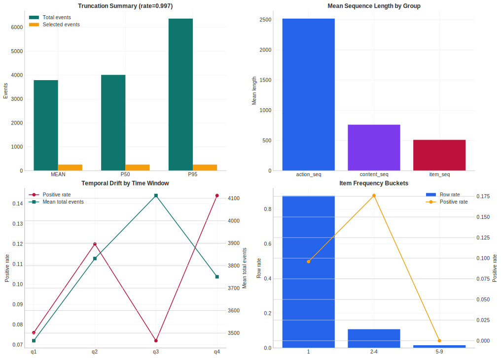
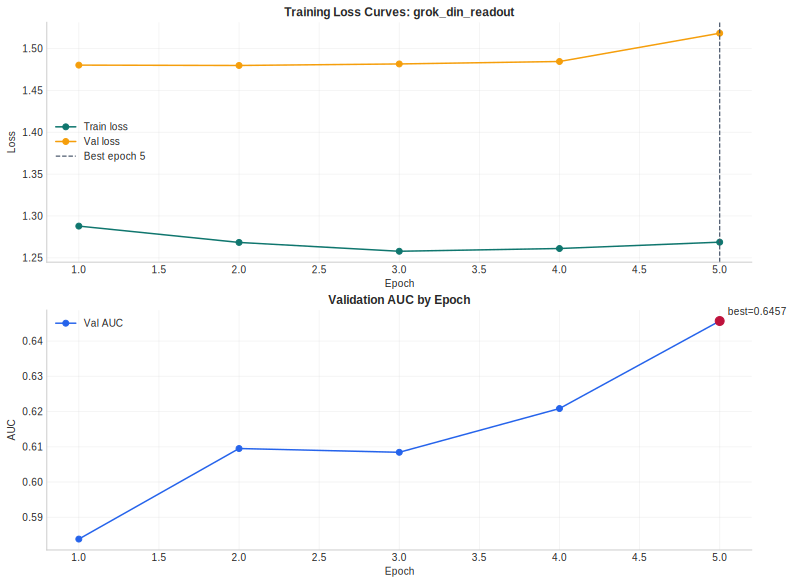
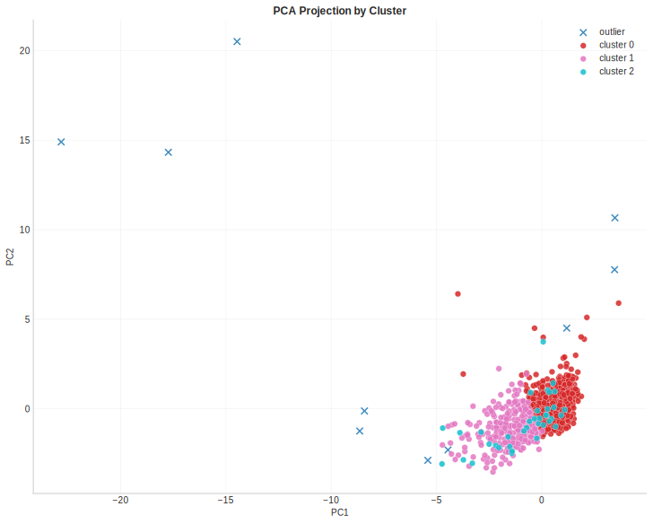
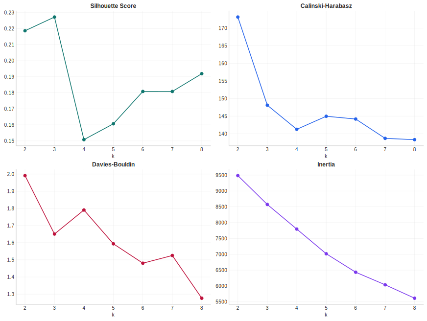
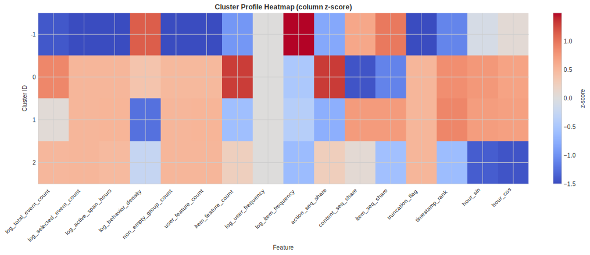
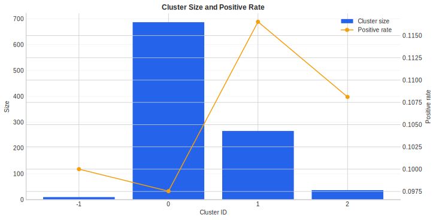

# TAAC_2026

> [!NOTE]  
> 这是TAAC其中一个参赛队伍的代码仓库, 不代表官方文档

https://algo.qq.com/#intro

## Introduction
**迈向统一序列建模与特征交互的大规模推荐系统**

推荐系统作为大规模内容平台（信息流、短视频等）与数字广告（点击率/转化率预估等）的核心引擎，直接决定了用户体验、参与度及平台商业收益。面对海量并发请求与严苛的实时响应约束，现代推荐系统每日需完成数十亿次在线决策，支撑起规模庞大的数字广告生态。过去二十年间，推荐技术主要沿两条路径演进：一是**特征交互模型**，专注于高维稀疏多域特征与上下文信号的深度交叉；二是**序列模型**，借助 Embedding 检索与 Transformer 架构捕捉用户行为的时序动态。尽管两条路线各自成果丰硕，但长期以来的割裂发展导致工业界系统面临结构性瓶颈：跨范式交互浅层化、优化目标不一致、扩展能力受限，以及日益攀升的硬件与工程复杂度。随着序列长度与模型参数的持续增长，这种碎片化架构的效率瓶颈愈发凸显。

近年来，学界与工业界开始探索融合这两大传统分支的统一建模范式 [1–3]。为加速该方向的突破，我们发起"**迈向统一序列建模与特征交互的大规模推荐系统**"挑战赛。我们鼓励参赛者设计统一的 Tokenization 方案与同质化、可堆叠的骨干网络，在单一架构内同时建模用户行为序列与非序列多域特征，完成转化率预估任务。参赛队伍将依据 ROC 曲线下面积（AUC）进行统一排名。除排行榜外，本次大赛特设两项创新奖——**统一模块创新奖**（45,000 美元）与**Scaling Law 创新奖**（45,000 美元），分别表彰在统一架构设计与系统性缩放规律探索方面的杰出工作。创新奖与排行榜名次独立评审，研讨会论文录用将重点考察方法在上述两个方向的新颖性与洞察力，而非单纯追求 AUC 指标。

------

## 我们的工作

本仓库聚焦两大核心能力：

1. **Grok 风格 Unified Baseline**：作为持续迭代的主线实现，提供统一的序列建模与特征交互框架。
2. **公开方案适配接口**：将多种业界公开方案无缝接入 TAAC Parquet 数据流，统一至单候选二分类任务范式。

## 可视化图表集

所有可视化图表按实验轮次归档至 `docs/visualizations/round_001/` 与 `docs/visualizations/round_002/` 目录，统一通过 `uv run ... --formats svg` 命令导出为矢量格式，便于版本管理、学术排版与汇报复用。

<table>
	<tr>
		<td width="50%" valign="top">
			<p><strong>实验总览图</strong></p>
			
		</td>
		<td width="50%" valign="top">
			<p><strong>AUC-时延 Pareto 图</strong></p>
			
		</td>
	</tr>
	<tr>
		<td width="50%" valign="top">
			<p><strong>截断策略总结图</strong></p>
			
		</td>
		<td width="50%" valign="top">
			<p><strong>样例数据画像图</strong></p>
			
		</td>
	</tr>
	<tr>
		<td width="50%" valign="top">
			<p><strong>grok_din_readout 训练曲线</strong></p>
			
		</td>
		<td width="50%" valign="top">
			<p><strong>聚类 PCA 投影图</strong></p>
			
		</td>
	</tr>
	<tr>
		<td width="50%" valign="top">
			<p><strong>聚类候选 k 评分图</strong></p>
			
		</td>
		<td width="50%" valign="top">
			<p><strong>聚类画像热力图</strong></p>
			
		</td>
	</tr>
	<tr>
		<td width="50%" valign="top">
			<p><strong>Cluster 规模与正样本率</strong></p>
			
		</td>
		<td width="50%" valign="top"></td>
	</tr>
</table>


当前 baseline 的核心结构：

1. 统计 dense feature 压缩为 static token。
2. user 与 context feature 保留为 context token 序列。
3. action_seq、content_seq、item_seq 统一编码为 history token 序列，注入事件组件、sequence group 与 time gap。
4. 目标 item 及其 feature 压缩为单个 candidate token。
5. Grok 风格统一 transformer 建模：static prefix 双向注意力，history 仅看 static prefix 与更早历史，candidate 读取整个 prefix 与自身。
6. candidate output 输出 CTR 二分类预测。

当前 baseline 已具备：

1. 样例 parquet 数据读取。
2. 时间切分验证。
3. AUC、PR-AUC、Brier、logloss 等多指标评估。
4. 按序列长度、行为密度、时间窗口分桶的验证看板。
5. 推理延迟基准统计。
6. 单模型主线持续迭代接口。

当前 unified 主线新增两个 target-aware readout 变体：`configs/grok_din_readout.yaml` 与 `configs/unirec_din_readout.yaml`。前者在 Grok backbone 输出端叠加 post-transformer DIN-style history readout；后者在 UniRec feature cross + interest token 基础上叠加同类 readout，验证 target-aware 耦合的叠加效果。

在此基础上，仓库已接入以下公开方案的适配版本：

| 方案                           | 配置文件                                      | 原始仓库                                                                                                                        |
| ------------------------------ | --------------------------------------------- | ------------------------------------------------------------------------------------------------------------------------------- |
| creatorwyx DIN adapter         | `configs/creatorwyx_din_adapter.yaml`         | [creatorwyx/TAAC2026-CTR-Baseline](https://github.com/creatorwyx/TAAC2026-CTR-Baseline)                                         |
| creatorwyx grouped DIN adapter | `configs/creatorwyx_grouped_din_adapter.yaml` | [creatorwyx/TAAC2026-CTR-Baseline](https://github.com/creatorwyx/TAAC2026-CTR-Baseline)                                         |
| Tencent 2025 SASRec adapter    | `configs/tencent_sasrec_adapter.yaml`         | [TencentAdvertisingAlgorithmCompetition/baseline_2025](https://github.com/TencentAdvertisingAlgorithmCompetition/baseline_2025) |
| zcyeee retrieval-style adapter | `configs/zcyeee_retrieval_adapter.yaml`       | [zcyeee/TAAC](https://github.com/zcyeee/TAAC)                                                                                   |
| O_o retrieval-style adapter    | `configs/oo_retrieval_adapter.yaml`           | [salmon1802/O_o](https://github.com/salmon1802/O_o)                                                                             |
| OmniGenRec-style adapter       | `configs/omnigenrec_adapter.yaml`             | [mx-Liu123/OmniGenRec-TAAC2025](https://github.com/mx-Liu123/OmniGenRec-TAAC2025)                                               |
| DeepContextNet                 | `configs/deep_context_net.yaml`               | [suyanli220/TAAC-2026-Baseline](https://github.com/suyanli220/TAAC-2026-Baseline-Tencent-Advertisement-Contest)                 |
| UniRec                         | `configs/unirec.yaml`                         | [hojiahao/TAAC2026](https://github.com/hojiahao/TAAC2026)                                                                       |
| UniScaleFormer                 | `configs/uniscaleformer.yaml`                 | [twx145/Unirec](https://github.com/twx145/Unirec)                                                                               |
| UniRec DIN readout             | `configs/unirec_din_readout.yaml`             | [hojiahao/TAAC2026](https://github.com/hojiahao/TAAC2026)                                                                       |

说明：上述复现统一复用本仓库的 parquet 编码、时间切分验证、多指标评估、分桶看板与延迟测试框架，属于"在本仓库任务设定下的结构适配复现"，而非逐字节复制外部仓库的数据管线与训练脚本。

详细训练、评估、可视化等命令请参考 [dev.md](dev.md)。

当前仓库还支持基于行为密度、序列结构、冷热度与时序位置的无监督聚类分析，可用 `uv run taac-feature-cluster` 自动完成候选 k 评估、最终分群、簇画像、cluster assignment 导出与聚类图表生成。

------

## Timeline
Global Registration Mar.19 — Apr.23 23:59:59 AOE

## Eligibility
Academic Track

## Dataset&Task

https://huggingface.co/datasets/TAAC2026/data_sample_1000

本次比赛发布的数据集经过完全匿名化处理，不反映腾讯广告平台的实际生产特性。

我们的数据集是一个基于真实广告日志构建的大规模工业级数据集，包含两个主要组成部分：(1) 用户行为序列 和 (2) 非序列多字段特征。

用户行为序列 包含用户与物品之间的交互事件（如曝光、点击、转化），每个事件都附带时间戳和行为类型等附加信息。多字段特征 包括用户属性、物品属性、上下文信号以及交叉特征。

为确保公平性和保护隐私，所有稀疏特征均以匿名整数ID表示，稠密特征则以固定长度的浮点向量提供。不发布任何原始内容（如文本、图像、URL）或个人身份信息。

此外，我们提供了一些示例样本供参考：

当前示例样本以JSON格式提供，但正式比赛所用数据可能基于此初步版本进行调整，包括格式和实际内容的可能变更。

**Sequential Data (e.g. one user behavior sequence)**
```json
{"user_id": "1", "seq": [{"item_id": 16612, "action_type": 1, "timestamp": 1770564000}, {"item_id": 49638, "action_type": 1, "timestamp": 1770564000}, ..., {"item_id": 173346, "action_type": 3, "timestamp": 1766960100}, ..., {"item_id": 49495, "action_type": 2, "timestamp": 1766576760}, ..., {"item_id": 1753, "action_type": 4, "timestamp": 1766399880}], ...}
```

**User Features (e.g. one specific user)**
```json
[{"feature_id": 10, "feature_value_type": "int_array", "int_array": [1]},      // Marital Status
 {"feature_id": 8, "feature_value_type": "int_value", "int_value": 1},       // Gender
 {"feature_id": 7, "feature_value_type": "int_value", "int_value": 44}, ...] // Age
```

**Item Features (e.g. one specific item)**
```json
[{"feature_id": 70, "feature_value_type": "int_value", "int_value": 2},      // Type
 {"feature_id": 60, "feature_value_type": "int_value", "int_value": 3},      // Category
 {"feature_id": 72, "feature_value_type": "int_value", "int_value": 2}, ...] // Advertiser Type
```

**Context Features (e.g. one specific session)**
```json
[{"feature_id": 17, "feature_value_type": "int_value", "int_value": 3},      // Device Brand
 {"feature_id": 21, "feature_value_type": "int_value", "int_value": 3}, ...] // OS Type
```

**Cross Features**
```json
[{"feature_id": 25, "feature_value_type": "float_array", "float_array": [0.111, 0.057, 0.121, 0.043, -0.066, 0.081, 0.038, 0.105, -0.026, ...]}, ...] // User Embedding
```

## Evaluation
我们将使用单一的ROC曲线下面积（AUC）指标对所有团队进行排名（越高越好）。为确保实用性，每次提交还必须在官方评估环境和协议下满足特定于赛道和轮次的推理延迟限制；超出延迟预算的提交将被视为无效，因此不予排名，无论AUC分数如何。

为鼓励与我们主题一致的创新——构建一个统一模块，弥合序列建模与多字段特征交互之间的鸿沟，并探索推荐系统的缩放规律——我们还将提供两项创新奖：统一模块创新奖（45,000美元）和缩放规律创新奖（45,000美元）。这些奖项与排行榜排名无关。最终获奖决定将由委员会根据提交的技术报告、代码以及所提方法的新颖性和洞察力进行综合评审，特别是围绕本次比赛强调的两个方向，而非仅关注最终AUC分数。

## Rules
**评分标准**
比赛设有两条平行赛道，分别拥有独立的排行榜。  
学术赛道仅限团队成员全部隶属于大学或学院的队伍参加（如本科生、硕士生或博士生；需提供学术 affiliation 证明）。工业赛道则无资格限制，向所有参与者开放。为更好地反映部署约束，工业赛道将执行更严格的推理延迟限制。  
为强调方法论的清晰性并实现公平比较，我们禁止在整个比赛中使用模型集成。

比赛采用两阶段评估框架，逐步强调预测准确性、可扩展性、效率和可复现性。在第一轮（开放初赛阶段），所有团队将在隐藏测试集上根据官方评估指标进行排名，同时实施严格的防过拟合控制（如提交限制和延迟反馈）。如有必要，将实施容量感知滚动准入机制（支持多达5,000支并发团队），以确保公平的资源访问。第一轮结束时，排行榜将被冻结，前50名学术团队和前20名工业团队将仅根据官方指标表现晋级第二轮。
第二轮在约10倍更大规模的数据集上评估模型的鲁棒性和大规模建模能力，同时设置严格的推理延迟限制，以鼓励采用GPU高效统一架构。每支决赛团队将获得相当的计算资源，且所有提交必须通过官方环境中的可复现性和规则合规性验证。

## 相关工作
以下按公开可访问资料整理，优先保留能直接借鉴代码、EDA、方法说明和赛事资料的链接，持续补充。
调查时间: 2026-04-02

**2025届：官方 / 公开代码**  
1. [TencentAdvertisingAlgorithmCompetition/baseline_2025](https://github.com/TencentAdvertisingAlgorithmCompetition/baseline_2025) 官方 parquet baseline，主体为 SASRec，并附带 faiss-based-ann 检索与 RQ-VAE 扩展入口。  
2. [zcyeee/TAAC](https://github.com/zcyeee/TAAC) 决赛方案公开仓库，README 给出生成式 next-item 推荐框架、训练流程与 Top-K 推理脚本。  
3. [salmon1802/O_o](https://github.com/salmon1802/O_o) O_o 队伍公开代码，仓库说明标注为 2025 初赛第十四名 / 初赛 Top 1%。  
4. [mx-Liu123/OmniGenRec-TAAC2025](https://github.com/mx-Liu123/OmniGenRec-TAAC2025) 复现 OmniGenRec 两个关键组件，README 给出 HR@10 / NDCG@10 的提升记录。  

**2025届：博客 / 新闻 / 资料**  
1. [TAAC七日游](https://pd-ch.github.io/blog/2025-07-31-taac-participate-record/) 一份较完整的个人复盘，覆盖论文补课、RQ-VAE/HSTU 学习、实验记录和比赛期资料整理。  
2. [从算法大赛千名开外到鹅厂技术骨干，他们亲授“逆袭秘籍”｜学长深度访谈直播实录](https://mp.weixin.qq.com/s/mAVOICmMOay_Axcr0IN4PA) 官方公众号文章，偏组队、工程化、提交策略和竞赛节奏。  
3. [一文读懂算法大赛前沿赛题｜赛前必看攻略第7期](https://mp.weixin.qq.com/s/xz0kb-xjCOy_A0k_gYwKeg) 官方赛前攻略，梳理赛题重点、baseline 思路和优化方向。  
4. [Angel平台&GPU虚拟化技术全解析｜赛期进阶攻略第1期](https://mp.weixin.qq.com/s/yzqPYYm0Ybf8_6A-IlIYBQ) 官方平台资料，偏训练环境、GPU 虚拟化和赛期工程细节。  

**2026届：公开仓库 / 方案**  
1. [creatorwyx/TAAC2026-CTR-Baseline](https://github.com/creatorwyx/TAAC2026-CTR-Baseline) DIN baseline，侧重流式清洗、地址簿随机读取与单机训练工程化。  
2. [suyanli220/TAAC-2026-Baseline-Tencent-Advertisement-Contest](https://github.com/suyanli220/TAAC-2026-Baseline-Tencent-Advertisement-Contest) DeepContextNet baseline，显式走 HSTU 风格序列建模与 Muon 优化器路线。  
3. [hojiahao/TAAC2026](https://github.com/hojiahao/TAAC2026) UniRec 方案，强调 unified tokenization、混合 attention mask、scaling law 和 2 卡 DDP。  
4. [twx145/Unirec](https://github.com/twx145/Unirec) UniScaleFormer 模板，内置 InterFormer / OneTrans / HyFormer / base 配置对比与 scaling law 脚本。  

**2026届：EDA / 资料入口**  
1. [hun9008/TAAC_DI_Lab_EDA](https://github.com/hun9008/TAAC_DI_Lab_EDA) 对公开 sample parquet 做了较完整的 EDA，包含 label 分布、序列长度、feature 密度和建模建议。  
2. [https://huggingface.co/datasets/TAAC2026/data_sample_1000](https://huggingface.co/datasets/TAAC2026/data_sample_1000) 官方样例数据页面。  
3. [https://algo.qq.com/#intro](https://algo.qq.com/#intro) 大赛主页。  

**系统参考**  
1. 本仓库内置了 xAI 开源的 x-algorithm 副本：third_party/x-algorithm  

## References
1. InterFormer: Effective Heterogeneous Interaction Learning for Click-Through Rate Prediction. CIKM, 2025.  
https://arxiv.org/abs/2411.09852  
2. OneTrans: Unified Feature Interaction and Sequence Modeling with One Transformer in Industrial Recommender. arXiv preprint, 2025.  
https://arxiv.org/abs/2510.26104  
3. HyFormer: Revisiting the Roles of Sequence Modeling and Feature Interaction in CTR Prediction. arXiv preprint, 2026.  
https://arxiv.org/abs/2601.12681