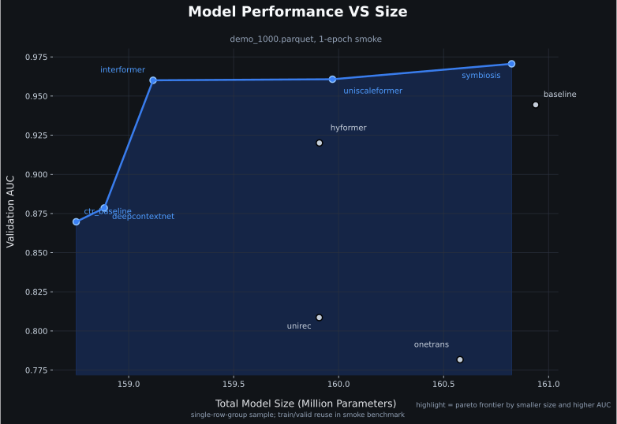
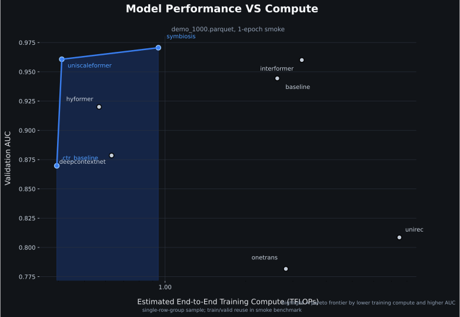

<h1 align="center">TAAC 2026 Experiment Workspace</h1>

<p align="center">
  <strong>迈向统一序列建模与特征交互的大规模推荐系统</strong>
</p>

<p align="center">
  <a href="https://github.com/Puiching-Memory/TAAC_2026/actions/workflows/ci.yml">
    
  </a>
  
  
  
  
  
  
</p>

<p align="center">
  <a href="https://algo.qq.com/#intro">Competition</a> ·
  <a href="docs/getting-started.md">Quick Start</a> ·
  <a href="docs/experiments/index.md">Experiments</a> ·
  <a href="docs/index.md">Docs</a>
</p>

> [!NOTE]
> 这是 TAAC 2026 其中一个参赛队伍的代码仓库，不代表官方文档。
> 我们的目标是提供一个开箱即用、便于扩展和回归验证的实验工作区，
> 以促进社区在统一序列建模与特征交互方向上的研究和创新。

> [!IMPORTANT]
> 本项目会继续维护，但仍有几条边界需要提前说明：
> 1. 我们无法保证 API 长期稳定。
> 2. 各子模型的研究与复现状态并不等于 100% 官方还原。
>
> 当前仓库更擅长的事情是：
> 1. 提供开箱可用的训练与评估框架。
> 2. 支持大算力场景下的超参数搜索和实验管理。
> 3. 持续同步最新论文、公开方案和可复核实验包。

这是一个面向 TAAC 2026 的实验工作区。我们把共享训练底座、目录式实验包、统一输出产物和回归测试放进同一套工程里，让新实验可以更快接入、训练、评估和复核。

## 项目简介

推荐系统作为大规模内容平台（信息流、短视频等）与数字广告（点击率/转化率预估等）的核心引擎，直接决定了用户体验、参与度及平台商业收益。面对海量并发请求与严苛的实时响应约束，现代推荐系统每日需完成数十亿次在线决策，支撑起规模庞大的数字广告生态。过去二十年间，推荐技术主要沿两条路径演进：一是**特征交互模型**，专注于高维稀疏多域特征与上下文信号的深度交叉；二是**序列模型**，借助 Embedding 检索与 Transformer 架构捕捉用户行为的时序动态。尽管两条路线各自成果丰硕，但长期以来的割裂发展导致工业界系统面临结构性瓶颈：跨范式交互浅层化、优化目标不一致、扩展能力受限，以及日益攀升的硬件与工程复杂度。随着序列长度与模型参数的持续增长，这种碎片化架构的效率瓶颈愈发凸显。

近年来，学界与工业界开始探索融合这两大传统分支的统一建模范式 [1–3]。为加速该方向的突破，我们发起"**迈向统一序列建模与特征交互的大规模推荐系统**"挑战赛。我们鼓励参赛者设计统一的 Tokenization 方案与同质化、可堆叠的骨干网络，在单一架构内同时建模用户行为序列与非序列多域特征，完成转化率预估任务。参赛队伍将依据 ROC 曲线下面积（AUC）进行统一排名。除排行榜外，本次大赛特设两项创新奖——**统一模块创新奖**（45,000 美元）与**Scaling Law 创新奖**（45,000 美元），分别表彰在统一架构设计与系统性缩放规律探索方面的杰出工作。创新奖与排行榜名次独立评审，研讨会论文录用将重点考察方法在上述两个方向的新颖性与洞察力，而非单纯追求 AUC 指标。

------

## 我们的工作





我们的目标很简单：在一套统一的 parquet batch 上，能快速接进来、跑起来、评估掉、还有回归保障。

1. `src/taac2026`：共享底座，提供 FolderExperiment 加载、训练入口、评估入口、基础指标，以及 checkpoint / summary 的读写能力。
2. `config/<name>`：目录式实验包。每个包自己管理 `data.py`、`model.py`、`utils.py`、`__init__.py`，配套说明统一收口到 `docs/experiments/<name>.md`，并直接导出 `EXPERIMENT`。

## 快速开始

```bash
uv python install 3.13
uv sync --locked

# 训练 starter baseline
uv run taac-train --experiment config/baseline

# 打包单个实验包为线上训练 zip
uv run taac-package-train --experiment config/baseline

# 用 optuna 搜索 baseline，默认会按当前可见 GPU 空闲显存自动并行派发 trial
# 默认约束仍然是参数量 <= 3 GiB、验证集端到端推理总时长 <= 180 秒
uv run taac-search --experiment config/baseline --trials 20

# 评估默认输出目录中的 best.pt；single 模式始终只评估一个实验/一个 checkpoint
uv run taac-evaluate single --experiment config/baseline
```

训练/评估默认会使用 HuggingFace 数据集名 `TAAC2026/data_sample_1000`。
你可以随时覆盖为本地或自定义数据源：

```bash
# 覆盖为本地 parquet
uv run taac-train --experiment config/baseline --dataset-path /path/to/train.parquet

# 覆盖为本地目录（包含 parquet）
uv run taac-train --experiment config/baseline --dataset-path /path/to/dataset_dir

# 覆盖为自定义 Hub 数据集名
uv run taac-train --experiment config/baseline --dataset-path some_owner/some_dataset
```

若目标 Hub 数据集尚未缓存，`datasets` 会自动下载并写入本地缓存。

仓库在 `pyproject.toml` 里固定了 `uv` 的 canonical 默认索引，用来保证 `uv.lock` 在本机和 CI 间保持一致。
如果你的机器全局把 `uv` 换到国内镜像，普通 `uv sync --locked` 仍会按项目配置工作；不要再额外传 `--default-index` 或 `--index-url` 指向镜像，否则 `uv` 会判定 `uv.lock` 需要更新。
如果只是想加速下载，优先使用系统代理、透明代理或企业缓存代理；如果你确实临时用镜像做过一次重锁，提交前请执行 `uv lock --default-index https://pypi.org/simple --python 3.13` 把锁文件归一回仓库基线。

```bash
# 跑完整训练栈回归
uv run pytest tests -q
```

更细的测试分层、Property/Fault/Recovery 回归入口和模块改动后的最小复核集合，见 `TESTING.md`。

## 当前独立实验包

| 实验包         | 目录                                                   | 公开来源                                                                                                                                      | 默认输出目录                 | 可复核状态                         |
| -------------- | ------------------------------------------------------ | --------------------------------------------------------------------------------------------------------------------------------------------- | ---------------------------- | ---------------------------------- |
| Baseline       | [config/baseline](config/baseline)                     | 本仓库维护的 starter/reference package，强调可扩展性、注释与二次开发体验                                                                     | `outputs/config/baseline`    | 可直接运行，待新一轮 smoke 记录    |
| Grok           | [config/grok](config/grok)                             | 从旧 `baseline` 中拆分出来的本地 grok 方案                                                                                                   | `outputs/config/grok`        | 历史产物仍保留在 legacy baseline 路径 |
| CTR Baseline   | [config/ctr_baseline](config/ctr_baseline)             | [creatorwyx/TAAC2026-CTR-Baseline](https://github.com/creatorwyx/TAAC2026-CTR-Baseline)                                                       | `outputs/config/ctr_baseline` | forward regression + smoke summary |
| DeepContextNet | [config/deepcontextnet](config/deepcontextnet)         | [suyanli220/TAAC-2026-Baseline-Tencent-Advertisement-Contest](https://github.com/suyanli220/TAAC-2026-Baseline-Tencent-Advertisement-Contest) | `outputs/config/deepcontextnet` | forward regression + smoke summary |
| InterFormer    | [config/interformer](config/interformer)               | [InterFormer paper](https://arxiv.org/abs/2411.09852)                                                                                         | `outputs/config/interformer` | forward regression + smoke summary |
| OneTrans       | [config/onetrans](config/onetrans)                     | [OneTrans paper](https://arxiv.org/abs/2510.26104)                                                                                            | `outputs/config/onetrans`    | forward regression + smoke summary |
| HyFormer       | [config/hyformer](config/hyformer)                     | [HyFormer paper](https://arxiv.org/abs/2601.12681)                                                                                            | `outputs/config/hyformer`    | forward regression + smoke summary |
| UniRec         | [config/unirec](config/unirec)                         | [hojiahao/TAAC2026](https://github.com/hojiahao/TAAC2026)                                                                                     | `outputs/config/unirec`      | forward regression + smoke summary |
| UniScaleFormer | [config/uniscaleformer](config/uniscaleformer)         | [twx145/Unirec](https://github.com/twx145/Unirec)                                                                                             | `outputs/config/uniscaleformer` | forward regression + smoke summary |
| O_o            | [config/oo](config/oo)                                 | [salmon1802/O_o](https://github.com/salmon1802/O_o)                                                                                           | `outputs/config/oo`          | forward regression + smoke summary |

更详细的训练命令、线上训练打包说明和各实验包说明，可以看 [docs/getting-started.md](docs/getting-started.md)、[docs/guide/online-training-bundle.md](docs/guide/online-training-bundle.md)、[docs/experiments/index.md](docs/experiments/index.md) 和 [docs/architecture.md](docs/architecture.md)。

------

## Timeline
1. Competition Begins - Mar.15, 2026 - 23:59:59 AOE - Releasing demo dataset
2. Global Registration - Mar.19 ~ Apr.23 - 23:59:59 AOE
3. First-round Competition - Apr.24 ~ May 23 - 23:59:59 AOE
4. Second-round Competition - May 25 ~ Jun.24 - 23:59:59 AOE
5. Winners Announcement - Jul.15, 2026 Winner Notification - Aug. 9, 2026 - Winner Public Announcement

## Our Eligibility
Academic Track

## Dataset&Task

https://huggingface.co/datasets/TAAC2026/data_sample_1000

本次比赛发布的数据集经过完全匿名化处理，不反映腾讯广告平台的实际生产特性。

我们的数据集是一个基于真实广告日志构建的大规模工业级数据集，采用扁平列布局（flat column layout），所有特征作为独立的顶级列存储在 Parquet 文件中。数据集包含 120 列，分为以下几类：

- **ID 与标签**（5 列）：`user_id`、`item_id`、`label_type`、`label_time`、`timestamp`
- **用户整型特征**（46 列）：`user_int_feats_{fid}` — 标量 `int64` 或 `list<int64>`
- **用户稠密特征**（10 列）：`user_dense_feats_{fid}` — `list<float>`
- **物品整型特征**（14 列）：`item_int_feats_{fid}` — 标量 `int64` 或 `list<int64>`
- **域行为序列特征**（45 列）：`domain_{a,b,c,d}_seq_{fid}` — `list<int64>`，来自 4 个行为域

为确保公平性和保护隐私，所有稀疏特征均以匿名整数ID表示，稠密特征则以固定长度的浮点向量提供。不发布任何原始内容（如文本、图像、URL）或个人身份信息。

此外，我们提供了一些示例样本供参考：

> ⚠️ **Update [2026.04.10]**: 示例数据集已更新为扁平列布局格式，特征名已重命名，新增序列特征。请参考最新的 `demo_1000.parquet` 和 HuggingFace 上的 README 获取最新 schema 详情。

```python
import pandas as pd
df = pd.read_parquet("demo_1000.parquet")
print(df.shape)       # (1000, 120)
print(df.columns)     # ['user_id', 'item_id', 'label_type', ...]
```

## Evaluation
我们将使用单一的ROC曲线下面积（AUC）指标对所有团队进行排名（越高越好）。为确保实用性，每次提交还必须在官方评估环境和协议下满足特定于赛道和轮次的推理延迟限制；超出延迟预算的提交将被视为无效，因此不予排名，无论AUC分数如何。

为鼓励与我们主题一致的创新——构建一个统一模块，弥合序列建模与多字段特征交互之间的鸿沟，并探索推荐系统的缩放规律——我们还将提供两项创新奖：统一模块创新奖（45,000美元）和缩放规律创新奖（45,000美元）。这些奖项与排行榜排名无关。最终获奖决定将由委员会根据提交的技术报告、代码以及所提方法的新颖性和洞察力进行综合评审，特别是围绕本次比赛强调的两个方向，而非仅关注最终AUC分数。

## Rules
**评分标准**
比赛设有两条平行赛道，分别拥有独立的排行榜。  
学术赛道仅限团队成员全部隶属于大学或学院的队伍参加（如本科生、硕士生或博士生；需提供学术 affiliation 证明）。工业赛道则无资格限制，向所有参与者开放。为更好地反映部署约束，工业赛道将执行更严格的推理延迟限制。  
为强调方法论的清晰性并实现公平比较，我们禁止在整个比赛中使用模型集成。

比赛采用两阶段评估框架，逐步强调预测准确性、可扩展性、效率和可复现性。在第一轮（开放初赛阶段），所有团队将在隐藏测试集上根据官方评估指标进行排名，同时实施严格的防过拟合控制（如提交限制和延迟反馈）。如有必要，将实施容量感知滚动准入机制（支持多达5,000支并发团队），以确保公平的资源访问。第一轮结束时，排行榜将被冻结，前50名学术团队和前20名工业团队将仅根据官方指标表现晋级第二轮。
第二轮在约10倍更大规模的数据集上评估模型的鲁棒性和大规模建模能力，同时设置严格的推理延迟限制，以鼓励采用GPU高效统一架构。每支决赛团队将获得相当的计算资源，且所有提交必须通过官方环境中的可复现性和规则合规性验证。

## 相关工作
以下按公开可访问资料整理，优先保留能直接借鉴代码、EDA、方法说明和赛事资料的链接，持续补充。
调查时间: 2026-04-13

**2025届：官方 / 公开代码**  
1. [TencentAdvertisingAlgorithmCompetition/baseline_2025](https://github.com/TencentAdvertisingAlgorithmCompetition/baseline_2025) 官方 parquet baseline，主体为 SASRec，并附带 faiss-based-ann 检索与 RQ-VAE 扩展入口。  
2. [zcyeee/TAAC](https://github.com/zcyeee/TAAC) 决赛方案公开仓库，README 给出生成式 next-item 推荐框架、训练流程与 Top-K 推理脚本。  
3. [salmon1802/O_o](https://github.com/salmon1802/O_o) O_o 队伍公开代码，仓库说明标注为 2025 初赛第十四名 / 初赛 Top 1%。  
4. [mx-Liu123/OmniGenRec-TAAC2025](https://github.com/mx-Liu123/OmniGenRec-TAAC2025) 复现 OmniGenRec 两个关键组件，README 给出 HR@10 / NDCG@10 的提升记录。  

**2025届：博客 / 新闻 / 资料**  
1. [TAAC七日游](https://pd-ch.github.io/blog/2025-07-31-taac-participate-record/) 一份较完整的个人复盘，覆盖论文补课、RQ-VAE/HSTU 学习、实验记录和比赛期资料整理。  
2. [从算法大赛千名开外到鹅厂技术骨干，他们亲授“逆袭秘籍”｜学长深度访谈直播实录](https://mp.weixin.qq.com/s/mAVOICmMOay_Axcr0IN4PA) 官方公众号文章，偏组队、工程化、提交策略和竞赛节奏。  
3. [一文读懂算法大赛前沿赛题｜赛前必看攻略第7期](https://mp.weixin.qq.com/s/xz0kb-xjCOy_A0k_gYwKeg) 官方赛前攻略，梳理赛题重点、baseline 思路和优化方向。  
4. [Angel平台&GPU虚拟化技术全解析｜赛期进阶攻略第1期](https://mp.weixin.qq.com/s/yzqPYYm0Ybf8_6A-IlIYBQ) 官方平台资料，偏训练环境、GPU 虚拟化和赛期工程细节。  

**2026届：公开仓库 / 方案**  
1. [creatorwyx/TAAC2026-CTR-Baseline](https://github.com/creatorwyx/TAAC2026-CTR-Baseline) DIN baseline，侧重流式清洗、地址簿随机读取与单机训练工程化。  
2. [suyanli220/TAAC-2026-Baseline-Tencent-Advertisement-Contest](https://github.com/suyanli220/TAAC-2026-Baseline-Tencent-Advertisement-Contest) DeepContextNet baseline，显式走 HSTU 风格序列建模与 Muon 优化器路线。  
3. [hojiahao/TAAC2026](https://github.com/hojiahao/TAAC2026) UniRec 方案，强调 unified tokenization、混合 attention mask、scaling law 和 2 卡 DDP。  
4. [twx145/Unirec](https://github.com/twx145/Unirec) UniScaleFormer 模板，内置 InterFormer / OneTrans / HyFormer / base 配置对比与 scaling law 脚本。  

**2026届：EDA / 资料入口**  
1. [hun9008/TAAC_DI_Lab_EDA](https://github.com/hun9008/TAAC_DI_Lab_EDA) 对公开 sample parquet 做了较完整的 EDA，包含 label 分布、序列长度、feature 密度和建模建议。  
2. [https://huggingface.co/datasets/TAAC2026/data_sample_1000](https://huggingface.co/datasets/TAAC2026/data_sample_1000) 官方样例数据页面。  
3. [https://algo.qq.com/#intro](https://algo.qq.com/#intro) 大赛主页。  

**通用开源框架 / Benchmark**  
1. [reczoo/FuxiCTR](https://github.com/reczoo/FuxiCTR) CTR 预测开源底座，长处是可配置、可调参与可复现实验，适合快速对照经典 ranking 模型与数据管线。
2. [meta-recsys/generative-recommenders](https://github.com/meta-recsys/generative-recommenders) Meta 官方 HSTU / Generative Recommenders 代码，包含训练、推理与公开实验脚本，是统一生成式路线的重要工程参考。
3. [snap-research/GRID](https://github.com/snap-research/GRID) Semantic ID 生成式推荐框架，串起文本 embedding、RQ 式语义 ID 学习与 Transformer 解码，适合后续探索 item-side semantic tokenization。

## References
1. InterFormer: Effective Heterogeneous Interaction Learning for Click-Through Rate Prediction. CIKM, 2025.  
https://arxiv.org/abs/2411.09852  
2. OneTrans: Unified Feature Interaction and Sequence Modeling with One Transformer in Industrial Recommender. arXiv preprint, 2025.  
https://arxiv.org/abs/2510.26104  
3. HyFormer: Revisiting the Roles of Sequence Modeling and Feature Interaction in CTR Prediction. arXiv preprint, 2026.  
https://arxiv.org/abs/2601.12681
