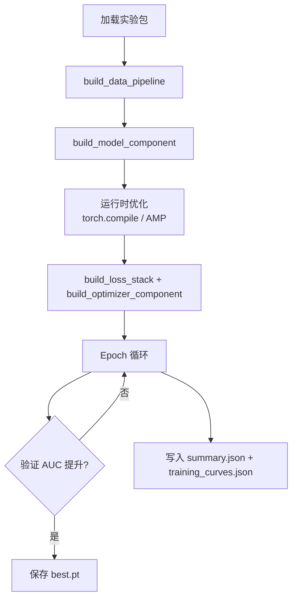

# 架构与概念

## 工程结构

```
TAAC_2026/
├── src/taac2026/          # 共享框架（不含具体模型实现）
│   ├── domain/            # 领域模型：配置、指标、运行时
│   ├── application/       # 应用层：训练、评估、搜索、报告 CLI
│   └── infrastructure/    # 基础设施：实验加载、数据集解析、GPU 调度
├── config/gen/            # 目录式实验包（每个包独立）
├── tests/                 # 测试套件
├── docs/                  # 文档
└── outputs/               # 训练输出产物（git 忽略）
```

## 核心抽象

### ExperimentSpec

`ExperimentSpec` 是实验包与框架之间的唯一契约。每个实验包的 `__init__.py` 必须导出一个名为 `EXPERIMENT` 的模块级对象：

```python
@dataclass(slots=True)
class ExperimentSpec:
    name: str
    data: DataConfig
    model: ModelConfig
    train: TrainConfig

    # 四个构建函数——由实验包各自实现
    build_data_pipeline: Callable       # → (train_loader, val_loader, DataStats)
    build_model_component: Callable     # → nn.Module
    build_loss_stack: Callable          # → (loss_fn, auxiliary_loss)
    build_optimizer_component: Callable # → optimizer

    switches: dict[str, bool]           # 子系统开关（logging, visualization）
    search: SearchConfig                # Optuna 搜索参数
    build_search_experiment: Callable | None  # 可选：搜索空间构建器
```

`ExperimentSpec` 支持 `clone()` 和 `derive(**overrides)` 方法，便于在搜索 trial 中派生新配置。

### 配置体系

```
DataConfig          ModelConfig            TrainConfig           SearchConfig
├─ dataset_path     ├─ vocab_size          ├─ epochs             ├─ n_trials
├─ max_seq_len      ├─ embedding_dim       ├─ batch_size         ├─ timeout_seconds
├─ max_feature_     ├─ hidden_dim          ├─ learning_rate      ├─ max_parameter_bytes
│  tokens           ├─ num_layers          ├─ weight_decay       │  (默认 3 GiB)
├─ label_action_    ├─ num_heads           ├─ grad_clip_norm     └─ max_end_to_end_
│  type             ├─ segment_count       ├─ pairwise_weight       inference_seconds
├─ dense_feature_   ├─ memory_slots        ├─ enable_torch_         (默认 180s)
│  dim              ├─ feature_cross_      │  compile
└─ val_ratio        │  layers              ├─ enable_amp
                    ├─ sequence_layers     └─ output_dir
                    ├─ fusion_layers
                    └─ num_queries
```

### 实验包隔离原则

每个实验包独立拥有自己的实现文件：

```
config/gen/<name>/
├── __init__.py    # 导出 EXPERIMENT
├── data.py        # build_data_pipeline 实现
├── model.py       # build_model_component 实现（模型架构）
└── utils.py       # build_loss_stack / build_optimizer_component 实现
```

!!! important "不允许跨包导入"
    `build_loss_stack` 和 `build_optimizer_component` 必须解析到各包自己的 `utils` 模块，不能从其他实验包导入。这保证了实验的独立可复现性。

## 训练流程



1. **加载实验包**：框架通过文件系统路径定位 `config/gen/<name>/`，发现项目导入根，动态导入并提取 `EXPERIMENT` 对象
2. **构建数据管道**：调用 `build_data_pipeline`，返回 `(train_loader, val_loader, DataStats)`
3. **构建模型**：调用 `build_model_component`，传入 `DataConfig`、`ModelConfig` 和 `dense_dim`
4. **运行时优化**：根据 `TrainConfig` 配置 `torch.compile` 与 AMP autocast
5. **构建损失与优化器**：各包自行选择损失函数组合（BCE + 可选 pairwise 损失）和优化器
6. **Epoch 循环**：前向 → 损失 → 反向 → 梯度裁剪 → 优化 → 验证
7. **产物输出**：最佳 checkpoint、训练摘要、曲线数据和 profiling 报告

## 评估指标

| 指标            | 说明                         | 函数               |
| --------------- | ---------------------------- | ------------------ |
| **AUC**         | ROC 曲线下面积（主排名指标） | `binary_auc()`     |
| **PR-AUC**      | 精确率-召回率曲线下面积      | `binary_pr_auc()`  |
| **Brier Score** | 概率校准误差                 | `binary_brier()`   |
| **LogLoss**     | 二元交叉熵损失               | `binary_logloss()` |
| **GAUC**        | 分组 AUC（按用户/会话分组）  | `group_auc()`      |

## 损失组合

框架使用 `Packet` / `Blackboard` / `LayerStack` 机制组合损失：

- **主损失**：BCE（二元交叉熵）
- **辅助损失**：可选 pairwise ranking loss（通过 `pairwise_weight` 控制权重）
- **子系统门控**：通过 `switches` 字典控制各损失层的开关

## 数据集

当前使用 HuggingFace 上的样例数据集 [`TAAC2026/data_sample_1000`](https://huggingface.co/datasets/TAAC2026/data_sample_1000)。

**数据格式（扁平列布局）：**

- **ID 与标签**：`user_id`、`item_id`、`label_type`（int32）、`label_time`、`timestamp`
- **用户特征**：`user_int_feats_{fid}`（标量/数组整型）、`user_dense_feats_{fid}`（浮点数组）
- **物品特征**：`item_int_feats_{fid}`（标量/数组整型）
- **域行为序列**：`domain_{a,b,c,d}_seq_{fid}`（`list<int64>`，4 个行为域共 45 列）

**标签**：`label_type == 2`（点击）作为二分类目标

**批处理张量**（`BatchTensors`）包含：候选 token、上下文 token、历史序列 token、掩码、稠密特征、标签、分组 ID。
