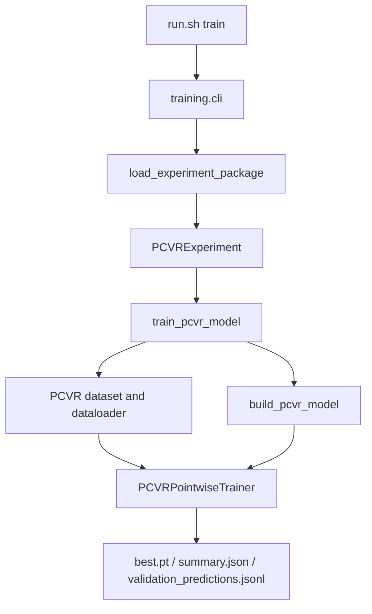

# 架构与概念

当前仓库的主路径是 PCVR 实验运行时。实验包只保留模型和少量包级资产；数据读取、训练、评估、checkpoint、线上打包都由共享运行时负责。

## 工程结构

```text
TAAC_2026/
├── run.sh                         # 本地与线上共用入口
├── config/                        # PCVR 实验包
│   └── <experiment>/
│       ├── __init__.py            # EXPERIMENT = PCVRExperiment(...)
│       ├── model.py               # 包内模型类
│       └── ns_groups.json         # 非序列特征分组资产
├── src/taac2026/
│   ├── application/               # train/evaluate/search/package/report CLI
│   └── infrastructure/
│       ├── pcvr/                  # PCVR 数据、协议、模型构建、trainer
│       └── training/              # 通用运行时辅助
├── tests/unit/                    # 当前可执行回归测试
├── docs/                          # 文档站点源码
└── outputs/                       # 训练、评估、打包输出
```

## 运行入口

`run.sh` 是用户和线上平台都应调用的入口：

| 命令 | 实际动作 |
| --- | --- |
| `train` | 调用 `taac2026.application.training.cli` |
| `val` / `eval` | 调用 `taac2026.application.evaluation.cli single` |
| `infer` | 调用 `taac2026.application.evaluation.cli infer` |
| `test` | 运行 pytest |
| `package` | 调用 `taac-package-train` 生成线上双文件 bundle |

同一个脚本有两种模式：

- 仓库本地模式：`run.sh` 同级没有 `code_package.zip`，默认通过 `uv` 运行，并按命令同步 `cpu` 或 `cuda126` profile。
- Bundle 模式：`run.sh` 同级存在 `code_package.zip`，默认用平台 `python`，解压代码包并设置 `PYTHONPATH`。

## 实验包契约

每个 `config/<experiment>/` 包导出一个 `PCVRExperiment`：

```python
from pathlib import Path

from taac2026.infrastructure.pcvr.experiment import PCVRExperiment


EXPERIMENT = PCVRExperiment(
    name="pcvr_example",
    package_dir=Path(__file__).resolve().parent,
    model_class_name="PCVRExampleModel",
    default_train_args=(
        "--ns_groups_json",
        "ns_groups.json",
        "--num_blocks",
        "2",
    ),
)
```

关键约定：

- `package_dir` 指向包目录，用于解析 `model.py`、`ns_groups.json` 和 bundle 资产。
- `model_class_name` 必须匹配 `model.py` 中导出的类名。
- 论文或实验专属模型体放在包内 `model.py`，不要集中塞进共享 runtime。
- 非 baseline 包不要复用 `PCVRHyFormer` 名称；baseline 保留它是因为它代表官方 HyFormer baseline。
- 包内不再新增 `run.sh`、`train.py` 或 `trainer.py`。

## 模型输入与构建

共享 runtime 会读取官方 parquet 与 `schema.json`，构造 `ModelInput`：

```text
official parquet + schema.json
        │
        ▼
PCVR dataset / dataloader
        │
        ▼
ModelInput
├── user_int_feats
├── item_int_feats
├── user_dense_feats
├── item_dense_feats
├── seq_data
├── seq_lens
└── seq_time_buckets
```

`build_pcvr_model` 根据 schema、模型配置和 `ns_groups.json` 调用包内模型构造函数。模型类通常复用 `taac2026.infrastructure.pcvr.modeling` 中的组件：

- `ModelInput`
- `EmbeddingParameterMixin`
- `NonSequentialTokenizer`
- `DenseTokenProjector`
- `SequenceTokenizer`
- `RMSNorm`
- `masked_mean`、`masked_last`、`make_padding_mask` 等 helper

模型行为要求：

- `forward(inputs: ModelInput)` 返回 logits。
- `predict(inputs: ModelInput)` 返回 `(logits, embeddings)`。
- 暴露 `num_ns`，供日志和 checkpoint 元数据使用。

## NS Groups

每个 PCVR 实验包都应包含 `ns_groups.json`，并在默认训练参数中传入：

```python
default_train_args=("--ns_groups_json", "ns_groups.json", ...)
```

runtime 会把 JSON 中的 fid 分组映射到当前 schema 的特征索引。显式配置的 NS groups 文件缺失时会直接失败，避免悄悄退化为 singleton 分组。checkpoint 会复制训练使用的 `ns_groups.json`，让评估和推理复用同一套分组。

## 训练流程



训练 CLI 负责统一参数解析：`--experiment`、`--dataset-path`、`--schema-path`、`--run-dir` 和 `--json`。其余参数会透传给 PCVR train parser，例如：

- `--batch_size`
- `--num_epochs`
- `--lr`
- `--device`
- `--num_workers`
- `--seq_max_lens`
- `--d_model`
- `--emb_dim`
- `--num_blocks`
- `--num_heads`
- `--loss_type`
- `--ns_groups_json`

当前 PCVR train parser 不支持历史训练栈里的 runtime optimization 参数；训练命令应只使用共享 PCVR parser 已声明的参数。

## 评估与推理

评估入口是：

```bash
bash run.sh val --experiment config/baseline \
    --dataset-path /path/to/data \
    --schema-path /path/to/schema.json \
    --run-dir outputs/config/baseline
```

`PCVRExperiment.evaluate()` 读取 checkpoint、构造模型和 dataloader，并写出：

- `evaluation.json`
- `validation_predictions.jsonl`

当前 PCVR 评估指标是 `auc`、`logloss` 和 `sample_count`。不要把历史服务里的扩展评估指标、量化导出或运行时优化能力写成当前 CLI 已支持的能力。

## 线上打包

`taac-package-train` 生成双文件上传目录：

```text
<training_bundle>/
├── run.sh
└── code_package.zip
```

`code_package.zip` 内只包含共享 runtime、`pyproject.toml`、`uv.lock`、顶层 `config/__init__.py` 和选中的实验包。平台执行 `run.sh` 后默认用 `python`，不会在线 `uv sync`。

## 当前边界

仍在仓库中保留的旧实验规范、TorchRec KJT、profile/search 代码可以作为历史素材和迁移参考，但新增或维护 PCVR 实验包时，以 `PCVRExperiment`、`ModelInput`、`ns_groups.json` 和共享 PCVR runtime 为准。